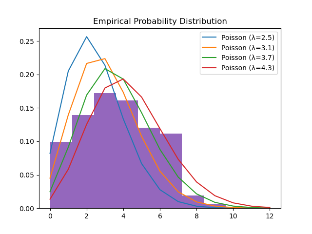

# HW 1 - JReiss

## Part 1 Code
```
import numpy as np

def problem_1a (A, B):
    return A + B

def problem_1b (A, B, C):
    return A*B + np.transpose(C)

def problem_1c (x, y):
    return np.transpose(x).dot(y)

def problem_1d (A, j):
    return np.sum(A[::2,j])

def problem_1e (A, c, d):
    return np.mean(A[np.logical_and(A >= c, A <= d)])

def problem_1f (x, k, m, s):
    #x = column vector of length n
    #k = int
    #m,s= positive scalars
    #return n*k matrix
    z = np.ones(np.shape(x))
    I = np.identity(np.shape(x)[0])
    return np.random.multivariate_normal((x + m*z), s*I, k, tol=1).transpose()

def problem_1g (A):
    return np.apply_along_axis(np.random.permutation, 0, A)

def problem_1h (x):
    return ((x - np.mean(x))/np.std(x))

def problem_1i (x, k):
    return np.reshape(np.repeat(x,k),(np.shape(x)[0], k))


```
## Part 2
### 2a
The code is not subtracting the minimum row element from the respective row because the np.subtract() method is broadcasting row_min row-wise, causing [0,3,6] to repeat as a row rather than a column.
| Desired Behavior    | Current Behavior |
|:---------------------:|:------------------:|
| [0] →<br>[3] →<br>[6] → | [0 3 6]<br> ↓ ↓ ↓  |

### 2b
```
def problem2b(Y):
    #Assumptions:
    # Y is (3,3,3)
    # Row refers to the same values as in the code in 2a
    #   If this is not the case, axis would need to be changed:
    #   Shape = (depth, column, row) when mapped from X
    #     axis = 0: Rows are defined along depth
    #     axis = 1: Rows are defined as columns in each layer of depth
    #     axis = 2: Rows are defined as rows in each layer of depth

    #Code:
    row_min = Y.min(axis=2).repeat(3).reshape(3,3,3)
    print(f"row_min:\n{row_min}")
    print(Y-row_min)
```

## Part 3
### Code:
```
def linear_regression (X_tr, y_tr):
    #Eq from slides: (XX^T)^-1 Xy
    #Modified to fit X from starter code:
    #   (X^TX)^-1 X^Ty
    Xy = np.dot(X_tr.transpose(), y_tr)
    XXT = np.dot(X_tr.transpose(),X_tr)
    w = np.linalg.solve(XXT, Xy)
    return w

def train_age_regressor ():
    # Load data
    X_tr = np.reshape(np.load("age_regression_Xtr.npy"), (-1, 48*48))
    y_tr = np.load("age_regression_ytr.npy")
    X_te = np.reshape(np.load("age_regression_Xte.npy"), (-1, 48*48))
    y_te = np.load("age_regression_yte.npy")

    w = linear_regression(X_tr, y_tr)

    # Report fMSE cost on the training and testing data (separately)
    yhat_tr = np.dot(X_tr, w)
    yhat_te = np.dot(X_te, w)

    #Calculate MSE
    fMSE_tr = np.mean((yhat_tr - y_tr)**2)
    fMSE_te = np.mean((yhat_te - y_te)**2)
    print(f"fMSE Training Data: {fMSE_tr}\nfMSE Testing Data: {fMSE_te}")

train_age_regressor()
```

### Results
fMSE Training Data: 80.83989366124689 \
fMSE Testing Data: 749.2990497211227 \
*Note: This is not 1/2 MSE

## Part 4
### 4a

Based on visual analysis, $\lambda$ of 4.3 seems to be closet to the empirical data.

### 4b
i. y tends to be larger for larger magnitudes of x. This is because the standard deviation greatly decreases as |x| increases.

ii. Uncertainty in the value of y increases with a decreasing magnitude of x. This is because as |x| decreases, the standard deviation increases.

iii. Using scipy, the probability that a random variable sampled from Y is ~73.27%.\
Code:
```
print(1 - norm.cdf(0, loc=1, scale=(2 - 1/(1+ 1/math.e))**2))
```

## Part 5
### 5a
Claim: $\nabla x(x^Ta) = \nabla x(a^Tx) = a$

|Proof: $x^Ta = a^Tx$|
|:---:|
$x^Ta = x_1a_1 + ... + x_na_n = \sum x_ia_i$
$a^Tx = a_1x_1 + ... + a_nx_n =\sum a_ix_i$

$\therefore$ since $x_ia_i = a_ix_i$, these values are equal.

|Proof: $\nabla x(x^Ta) = a$|
|:-----:|
Let $ f= x^Ta$ 
$f = x_1a_1 + ... + x_na_n$ 
$\frac{\partial f}{\partial x_1} = 1a_1 + 0a_2 + ... 0a_n$
$\frac{\partial f}{\partial x_2} = 0a_1 + 1a_2 + ... 0a_n$
⋮
$\frac{\partial f}{\partial x_n} = 0a_1 + 0a_2 + ... 1a_n$

$\therefore \nabla xf = \begin{bmatrix} \frac{\partial f}{\partial x_1} \\ ⋮ \\ \frac{\partial f}{\partial x_n} \end{bmatrix} = \begin{bmatrix} a_1 \\ ⋮ \\ a_n \end{bmatrix} = a$

### 5b
Claim: $\nabla x(x^Tw - b)^2 = 2(x^Tw -b)w$ \
Proof: \
let $f = x^Tw - b$ \
By the chain rule, $\nabla x((f)^2) = 2f * \nabla xf$ \
Substitute f for its value to get: \
$2(x^Tw - b) * \nabla x(x^Tw -b)$ \
$\nabla x(x^Tw -b) = \nabla x(x^Tw)$ since b is a scalar \
From the proof in 5a, we know that $\nabla x(x^Tw) = w$\
$\therefore 2(x^Tw - b) * \nabla x(x^Tw) = 2(x^Tw - b)w$ and the claim holds.\

### 5c
Claim: $\nabla x(x^TAx) = (A + A^T)x$\
Proof:\
let $f = x(x^TAx) = \sum_{j=1}^{n} \sum_{i=1}^{n} a_{ij}x_ix_j$ by definition. We can then apply the product rule of matrices and vectors, which gets us: \
$x^T\nabla x(Ax) + (Ax)^T \nabla x(x^T)$\
This can be written in summation notation as: \
$\frac{\partial f}{\partial x_k} = \sum_{j=1}^{n} a_{kj}x_j + \sum_{i=1}^{n} a_{ik}x_i$ \
Which in matrix notiation equates to: \
$x^TA^T + x^TA$
$= x^T(A^T + A)$


### 5d
Given the proof in 5c (or the assumption that the claim holds if my proof is wrong), we know that $\nabla x(x^TAx) = (A + A^T)x$. By definition, a symmetric nxn matrix is equal to its transpose. Thus, $\nabla x(x^TAx) = (A + A^T)x = (A + A)x = 2Ax$

### 5e
I do not know how to do this. Will be in office hours :/

## All Code Together
```
import numpy as np
from matplotlib import pyplot as plt
from scipy.stats import poisson

def problem_1a (A, B):
    return A + B

def problem_1b (A, B, C):
    return A*B + np.transpose(C)

def problem_1c (x, y):
    return np.transpose(x).dot(y)

def problem_1d (A, j):
    return np.sum(A[::2,j])

def problem_1e (A, c, d):
    return np.mean(A[np.logical_and(A >= c, A <= d)])

def problem_1f (x, k, m, s):
    #x = column vector of length n
    #k = int
    #m,s= positive scalars
    #return n*k matrix
    z = np.ones(np.shape(x))
    I = np.identity(np.shape(x)[0])
    return np.random.multivariate_normal((x + m*z), s*I, k, tol=1).transpose()

def problem_1g (A):
    return np.apply_along_axis(np.random.permutation, 0, A)

def problem_1h (x):
    return ((x - np.mean(x))/np.std(x))

def problem_1i (x, k):
    return np.reshape(np.repeat(x,k),(np.shape(x)[0], k))


def linear_regression (X_tr, y_tr):
    #Eq from slides: (XX^T)^-1 Xy
    #Modified to fit X from starter code:
    #   (X^TX)^-1 X^Ty
    Xy = np.dot(X_tr.transpose(), y_tr)
    XXT = np.dot(X_tr.transpose(),X_tr)
    w = np.linalg.solve(XXT, Xy)
    return w

def train_age_regressor ():
    # Load data
    X_tr = np.reshape(np.load("./age_regression_Xtr.npy"), (-1, 48*48))
    y_tr = np.load("./age_regression_ytr.npy")
    X_te = np.reshape(np.load("./age_regression_Xte.npy"), (-1, 48*48))
    y_te = np.load("./age_regression_yte.npy")

    w = linear_regression(X_tr, y_tr)

    # Report fMSE cost on the training and testing data (separately)
    yhat_tr = np.dot(X_tr, w)
    yhat_te = np.dot(X_te, w)

    #Calculate MSE
    fMSE_tr = np.mean((yhat_tr - y_tr)**2)
    fMSE_te = np.mean((yhat_te - y_te)**2)
    print(f"fMSE Training Data: {fMSE_tr}\nfMSE Testing Data: {fMSE_te}")

def part4a():
    poissonX = np.load("HW1\PoissonX.npy")
    plt.title("Empirical Probability Distribution")
    rates = [2.5,3.1,3.7,4.3]
    for rate in rates:
        poisson_dist = poisson.pmf(range(0, max(poissonX)+1), rate)
        plt.plot(range(0, max(poissonX)+1), poisson_dist, label=f'Poisson (λ={rate})')
    plt.hist(poissonX, density=True)
    plt.legend()
    plt.show()

train_age_regressor()
part4a()
print(1 - norm.cdf(0, loc=1, scale=(2 - 1/(1+ 1/math.e))**2))
```


